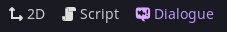
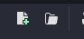

# 基础对话

在编辑器中导航到“对话”(Dialogue)选项卡。



通过点击“新建对话文件”按钮或“打开对话”按钮来打开一些对话。



通过点击“测试对话”`左边`来运行对话，还可以从指定行开始测试`右边`。


最基本的对话就是一个字符串：

```
这是一个对话。
```

如果你想添加一个正在说话的角色，那么在冒号前包含一个名字，然后是对话内容：

```
Nathan:这是我正在说话。
```

你可以使用 [BBCode](https://docs.godotengine.org/en/stable/tutorials/ui/bbcode_in_richtextlabel.html#reference) 为你的对话增添一些趣味。除了 Godot 的 `RichTextLabel` 可用的所有功能外，你还可以使用对话管理器提供的几个额外功能：

- `[[这个|或者这个|甚至是这个]]` 用于在对话中间随机选择一个选项（注意双`"[["`）。
- `[wait=N]`  N 是暂停对话显示的秒数。你也可以通过写入类似 `[wait="ui_accept"]` 的内容来等待操作触发，其中 "ui_accept" 为字符串形式（还可以等待多个操作，例如： `[wait=["ui_accept","ui_cancel"]]` ，或者直接等待任意操作，使用 `[wait]`）。
- `[speed=N]`  N 为文字默认显示速度的倍数。
- `[next=N]`  N 为在自动继续显示下一行对话前等待的秒数。你也可以使用 `[next=auto]` 让系统根据文本长度自动判断等待时长。

```
~ start
晓轩:[[你好!|Hello!|宝!]]
晓轩:你想选哪个?
- 第一个,返回开始 => start
- 第二个,继续 
晓轩: 哈哈哈哈哈，[wait=1]你果然选哪个了！
[next=1]
旅人:[wait=1]什么意思?
```

对话行按先后顺序依次书写：

```
Nathan: 我先说这个。
Nathan: 然后我会说这一行。
```

要为对话添加一些互动性，你可以指定**选项**。选项是以 `- ` 开头的行： ***注意是  "-"+"空格"***

```
- 这是一个选项。
- 这是一个不同的选项。
- 这是最后一个选项。
```


## 选项(Responses)
`response翻译为回应，这里一律理解为选项`

在选项之后创建分支对话的一种方法，是在每个选项下方嵌套更多对话。随着分支不断增加，嵌套式回复对话可以无限层级嵌套。

```
Nathan: 你开始了多少个项目但又没完成？
- 只有几个
    Nathan: 那还不错。
- 很多
    Nathan: 也许你应该在开始另一个之前先完成一个。
- 我总是完成我的项目
    Nathan: 太棒了！
    Nathan: ...但是完成了多少个呢？
    - 几个
        Nathan: 太棒了！
    - 我实际上一个都没开始
        Nathan: 和我想的一样。
```

选项可以有判断是否可选的条件。要在选项中加入条件，需添加用方括号包裹的条件表达式，示例如下：

```
- 这是一个普通的选项
- 这是一个条件选项 [if SomeGlobal.some_property == true]
```

## 随机化对话行

如果你想从多行中随机选择一行，你可以在行首标记一个 `%`， 像这样：

```
Nathan: 我会说这句。
% Nathan: 然后我可能会说这句
% Nathan: 或者也许这句
% Nathan: 甚至这句？
```

每一行被选中的概率相等。

要设置权重，使用 `%` 后跟一个数字来表示权重。例如，一个 `%2` 意味着该行被选中的概率是普通行的两倍。

```
%3 Nathan: 这行有 60% 的概率被选中
%2 Nathan: 这行有 40% 的概率被选中
```

要分隔多组随机行，使用空行：

```
% 第一组
% 也是第一组

% 第二组
% 这也是第二组
```

你也可以让整个代码块随机：
```
%
    Nathan: 这是第一个代码块。
    Nathan: 仍然是第一个代码块。
% Nathan: 这是可能的结果。
```

如果第一个随机项被选中，它会完整播放两个嵌套行。

## 对话中的变量

要在对话行中显示游戏状态的某个值，将其包裹在双花括号中`{{ }}`。

```
Nathan: 某个属性的值是 {{SomeGlobal.some_property}}。
```

同样，如果角色的名字由变量决定，你也可以用双花括号将其括起来：

```
{{SomeGlobal.some_character_name}}: 我的名字由玩家提供。
```

### 局部变量

如果你需要仅在对话期间存在的临时变量，可以使用局部变量。局部变量是仅在当前对话中存在的临时变量。当对话结束或切换对话文件时，这些变量会被删除。

*注意：`locals` 是示例气球提供的一个功能，用于演示如何处理临时状态，而不是对话管理器本身的内置功能。*

你可以通过两种方式创建局部变量：

1. **在对话中设置**，使用 `set` 或 `do`：

```
~ start
Nathan: 你想了解什么？
- 说说你自己 [if not locals.asked_about_nathan]
    set locals.asked_about_nathan = true
    Nathan: 嗯，我是一个喜欢制作对话系统的游戏开发者。
    => start
- 你最喜欢什么颜色？ [if not locals.asked_favorite_color]
    set locals.asked_favorite_color = true
    Nathan: 我会选蓝色，它让人感到平静。
    => start
- 就这些了
    Nathan: 好的，回头见！
    => END
```

2. **在开始对话时传递额外的游戏状态**（详情请参阅[额外游戏状态Extra Game States](./Conditions_Mutations.md#extra-game-states)）。来自额外游戏状态的变量可以直接引用，无需 `locals.` 前缀。

## 标签

如果你需要给对话添加标签注释，可以用 `[#` 和 `]` 包裹，用逗号分隔。因此，要为一行的对话指定 "happy" 和 "surprised" 标签，你可以这样写：*标签建议用英文*

```
Nathan: [#happy, #surprised] 哦，你好！
```

在运行时，`DialogueLine` 的 `tags` 属性将包含 `["happy", "surprised"]`。

你还可以给标签设置对应的值，这些值可以通过  `DialogueLine` 上的 `get_tag_value` 方法来获取。<br>
对于下面这行对话，`tags` 数组将是 `["mood=happy"]`，而 `line.get_tag_value("mood")` 将返回 `"happy"`。

```
Nathan: [#mood=happy] 哦，你好！
```


## 同步对话

如果你想让多个角色同时说话，可以使用并行台词语法。在一段普通对话之后，任何需要与其同时播放的台词，都可以用 `| ` 作为前缀。

```
Nathan: 这是一句普通的对话行。
| Coco: 我会同时说这句！
| Lilly: 我也会说这句！
```

要使用同步行，请访问 `DialogueLine` 上的 `concurrent_lines` 属性。

*注意：为保持功能简洁性，内置的示例对话气泡并未实现并行台词相关逻辑。*

## 标记和跳转
*同时出现 tag 和 label ，这里将 label 翻译为标记*

label是对话中的标记，你可以从它们开始或跳转到它们。通常，在游戏中你会通过提供一个标记来开始对话（默认标记是 `start`，但也可以是你在对话中写的任何内容）。

标记以 `~ ` 开头，并且有名称（不含空格）：

```
~ 这是一个标记
```

要从对话中的某处跳转到标记，你可以使用跳转指令 —— 跳转行。跳转行以 `=> ` 为前缀，然后指定要跳转到的标记：

```
=> 这是一个标记
```

当对话运行时遇到跳转指令，会将对话流程导向该标记的位置，并从该位置继续执行。
如果你想在对话中结束流程，可以跳转到 `END`：

```
=> END
```

这将结束当前的对话流程。

你还可以使用 “跳转并返回（jump and return）” 类型的跳转指令 —— 它会先将对话流程导向目标位置，执行完毕后再返回到跳转发起的位置继续执行。这类跳转行以 `=>< ` 为前缀，后跟要跳转到的标签名称。当流程遇到 `END`（或文件结尾），流程将返回到跳转起始位置，并从该位置继续执行。。

若你想强制终止整个对话流程（无论是否存在链式的 “跳转并返回” 指令），可以使用 `=> END!` 这一行指令。

跳转指令也可内联（inline）用于对话选项中：
```
~ start
Nathan: 那么，选哪个？
- 第一个
- 另一个 => another_label
- 重新开始 => start
=> END

~ another_label
Nathan: 另一个？
=> END
```

### 表达式跳转

你可以将表达式用作跳转指令。该表达式的运算结果必须是一个已定义的标记名称，否则会出现不可预期的结果。

**谨慎使用这些**，因为对话编译器无法在编译阶段验证表达式的值是否匹配任一标记（即仅在运行时才能发现错误）。

表达式跳转的写法示例如下：

`=> {{SomeGlobal.some_property}}`

## 将对话导入其他对话

如果你有一个包含通用对话的对话文件，并且希望在其他多个文件中复用这些内容，可将该文件  `import` 到目标文件中。

例如，我们可以有一个 `snippets.dialogue` 文件：

```
~ banter
Nathan: 等等等等。
=> END
```

然后我们可以将其导入另一个对话文件，并从 `snippets` 文件跳转到 `banter` 标记（注意 `=><` 语法的作用是：跳转的对话执行完毕后，会返回到当前这一行继续执行）：

```
import "res://snippets.dialogue" as snippets

~ start
Nathan: 下一行将来自 snippets 文件：
=>< snippets/banter
Nathan: 那是一些闲聊！
=> END
```

## 条件与变更

请参阅[条件与变更Conditions & Mutations](./Conditions_Mutations.md)。

## 翻译

请参阅[翻译Translations](./Translations.md)。